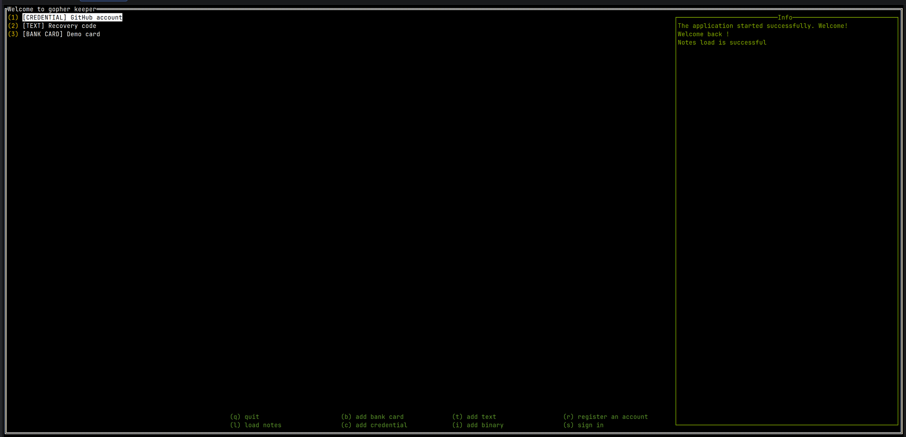
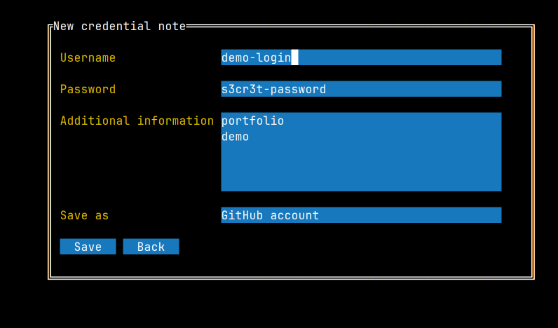
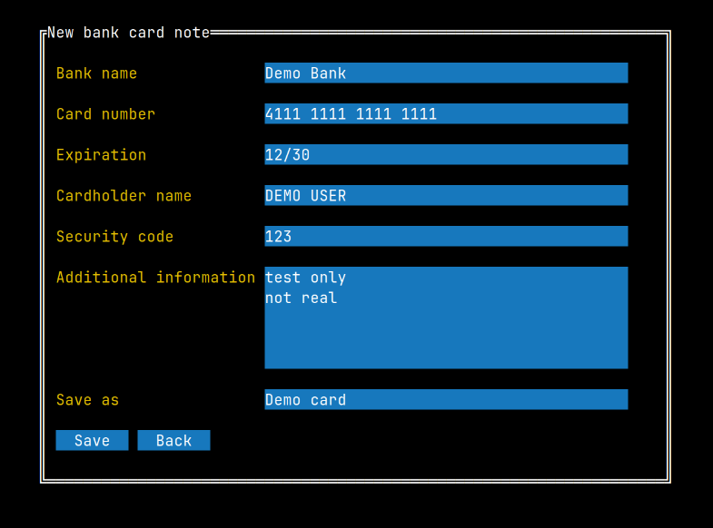

# GophKeeper

GophKeeper is a learning project: a client-server password manager written in Go.
It stores private user data (credentials, text notes, binary notes, and bank card records) and synchronizes it through a gRPC backend.

## Features

- User registration and login.
- JWT-based authentication.
- Encrypted note payloads on the client side.
- gRPC API for notes and users.
- Terminal UI client (TUI).
- SQLite storage with GORM.

## Project Structure

- `cmd/server` - gRPC server entrypoint.
- `cmd/client` - TUI client entrypoint.
- `cmd/seed` - local demo data seeding utility.
- `internal/interfaces/server` - server gRPC handlers.
- `internal/services/ui` - client interaction with API.
- `internal/database` - persistence layer.
- `internal/models` - domain models and note types.
- `testdata/local` - ready-to-use local configs and demo credentials.

## Tech Stack

- Go 1.22+
- gRPC + Protocol Buffers
- GORM + SQLite
- Logrus
- TView/TCell (terminal UI)

## Quick Start (Local Demo)

### 1. Start the server

```bash
./scripts/run-local.sh
```

This uses `testdata/local/server-config.json` and creates `demo.db` in the repository root.
If `private.pem` is missing, the script generates a local RSA key automatically.

### 2. Seed demo user and sample notes

In a second terminal:

```bash
./scripts/seed-local.sh
```

Seed defaults:

- username: `demo-user`
- email: `demo@example.com`
- password: `DemoPass123!`

Reference file: `testdata/local/demo-user.json`.

### 3. Run the TUI client

```bash
GOCACHE="$(pwd)/.cache/go-build" GOMODCACHE="$(pwd)/.cache/go-mod" \
  go run ./cmd/client -cfg testdata/local/client-config.json
```

Log in with the seeded credentials.

### Demo UI client (server should be started first)

```bash
./scripts/demo-ui.sh
```

This script launches the regular TUI client only.
Recommended demo flow:

```bash
./scripts/run-local.sh
./scripts/seed-local.sh
./scripts/demo-ui.sh
```

## UI Screenshots

<details>
  <summary>Main screen</summary>
  <br>
  
</details>

<details>
  <summary>Credential note form</summary>
  <br>
  
</details>

<details>
  <summary>Bank card note form</summary>
  <br>
  
</details>

## Configuration

Server config example (`testdata/local/server-config.json`):

```json
{
  "conn_addr": "localhost:3200",
  "log_level": "info",
  "crt_file": "private.pem",
  "db_file": "demo.db"
}
```

Client config example (`testdata/local/client-config.json`):

```json
{
  "conn_addr": "localhost:3200",
  "log_level": "info",
  "log_file": "client.log"
}
```

CLI flags override values from config files.

## Testing

```bash
GOCACHE="$(pwd)/.cache/go-build" GOMODCACHE="$(pwd)/.cache/go-mod" go test ./...
```

## Notes

This repository is learning as a portfolio project, focused on code clarity, practical architecture, and demonstration value.
It is not production-hardened and still has known limitations (global singletons, limited integration tests, no secret rotation).
